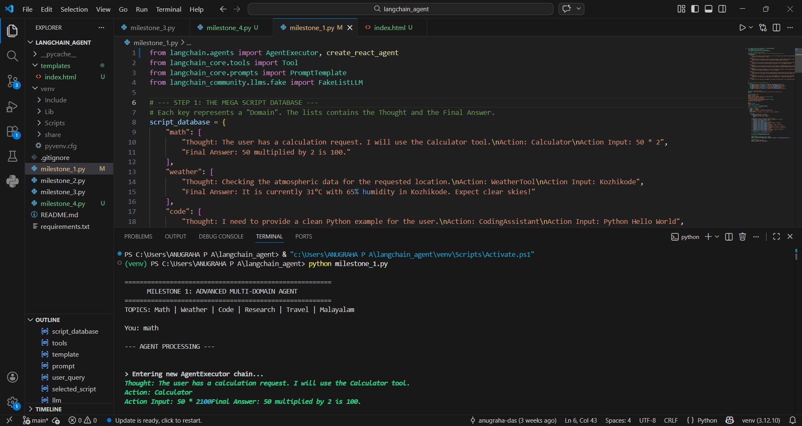
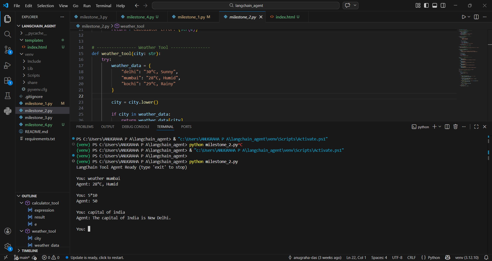
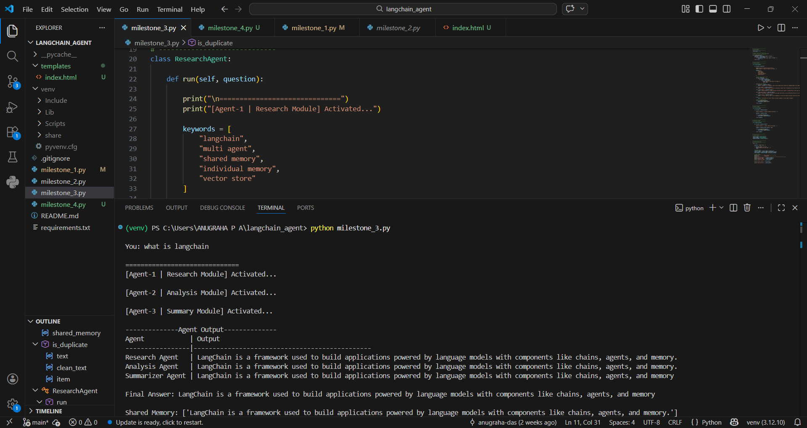
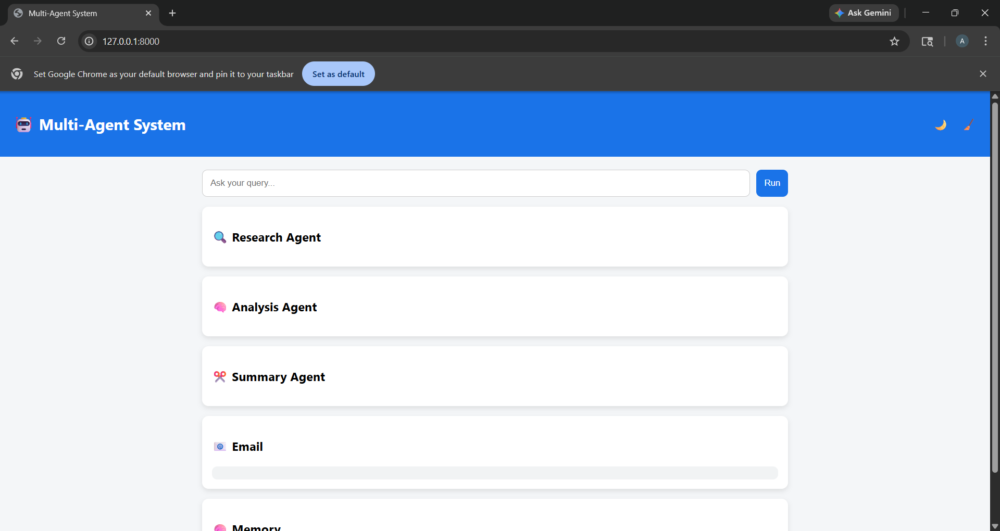

# langchain-agent-project
"The conductor for your LLM agents. An extensible LangChain-based engine for building, routing, and managing autonomous agentic workflows."

## 📑 Project Documentation
- [Download Milestone 4 Presentation (PDF)](./docs/Anugraha_PA_Milestone4.pdf)
- [Technical Architecture Diagram](./assets/architecture.png)

# ___ Agent-Orchestration Framework with LangChain____

> **---Infosys Springboard Virtual Internship 6.0 | Project Documentation---**

**Intern Name:** Anugraha P A  
**Mentor Name:** Devendar Pratap  
**Project:** Agent-Orchestration Framework with LangChain

---

## ---Project Overview---

This project focuses on the development of an **Agent-Orchestration Framework** using LangChain. It demonstrates the evolution of AI from simple prompt-based interactions to complex, multi-agent automated workflows. The system uses **ReAct logic**, custom tool integration, and a shared memory architecture to solve multi-step tasks, all exposed through a modern **FastAPI** web interface.

---

## ---Project Execution Details---

## ---Milestone 1: Environment Setup & Basic Agent---
**Objective:** Install LangChain and create a foundational conversational agent.
* **Tasks:** Set up Python environment, explore core blocks (LLMs, Prompts, Chains), and build a ReAct agent to respond to static queries.
* **Implementation:** Built a multi-domain agent using `FakeListLLM`. It uses keyword routing to simulate reasoning for Math, Weather, Code, and Research.

**Execution Snapshot:** 


---

## ---Milestone 2: Tool Integration & API Calling
**Objective:** Extend the agent’s functionality with custom tool access and error handling.
**Tasks:** Implement at least two tools (Calculator, Mock Weather API) and write prompts to guide the agent to use them appropriately.
* **Implementation:** Wrapped Python functions into LangChain `Tool` objects. Includes logic to handle `ZeroDivisionError` and "City Not Found" scenarios.

**Execution Snapshot:** 

---

## --- Milestone 3: Multi-Agent Orchestration & Memory
**Objective:** Enable agent collaboration and shared memory-based reasoning.
* **Tasks:** Define roles (Research, Analysis, Summarizer), implement inter-agent communication, and add a shared memory layer.
* **Implementation:** Created a "Sequential Blackboard" architecture. Agents check `shared_memory` before processing to ensure efficiency.

**Execution Snapshot:** 

---

### --- Milestone 4: Complex Workflow Automation & UI
**Objective:** Automate a multi-step task with API exposure and frontend interaction.
* **Tasks:** Design a "Research → Summarize → Email" workflow and build a REST API (FastAPI) with a web UI.
* **Implementation:** Integrated the entire pipeline into a FastAPI backend. The frontend allows users to input a query and see the real-time processing of the Research, Analysis, and Email agents.

**Execution Snapshot:** 

---

## --- Tech Stack & Installation ----

* **Framework:** LangChain (Core & Community)
* **Backend API:** FastAPI / Uvicorn
* **Frontend:** HTML/CSS (Jinja2 Templates)
* **Logic:** ReAct Reasoning Pattern (Reason + Act)


### How to Run

1. **Install dependencies:**

   Ensure you have the required libraries installed via terminal:
   ```bash
   pip install langchain langchain-community fastapi uvicorn jinja2

# <<<Run the application:
Navigate to your project folder in the terminal and start the server:

Bash
uvicorn main:app --reload
Access the UI: Open your browser and go to http://127.0.0.1:8000 to interact with the Multi-Agent System.

## --- Learnings & Challenges----

## ---Challenges:---
1.Information Redundancy: Initially, agents repeated the same research steps. This was solved by implementing a logic-based is_duplicate() helper function in the shared memory layer.

2.Input State Flow: Managing the data hand-off between the Research agent and the Email agent to ensure the final output was formatted correctly for the user.

3.Asynchronous Integration: Bridging the gap between a sequential Python script and a real-time FastAPI web response.

## ---Key Learnings:---

1.Modular AI Architecture: Learned that complex problems are best solved by breaking tasks into specialized agents (Research vs. Analysis).

2.Agentic Workflows: Gained hands-on experience in orchestrating multiple LLM calls into a single, automated industrial pipeline.

3.Full-Stack AI Deployment: Developed the skills needed to transform raw AI logic into a functional, user-facing web application.

## ---Acknowledgement---
I would like to express my sincere gratitude to my mentor, Devendar Pratap, for his constant guidance and technical insights. I also thank the Infosys Springboard Virtual Internship 6.0 team for providing this platform to explore the cutting-edge field of Agentic AI and LangChain orchestration.
